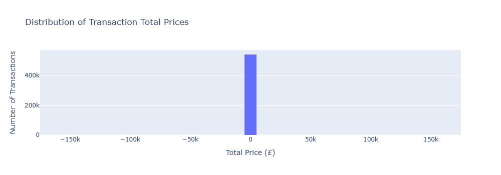
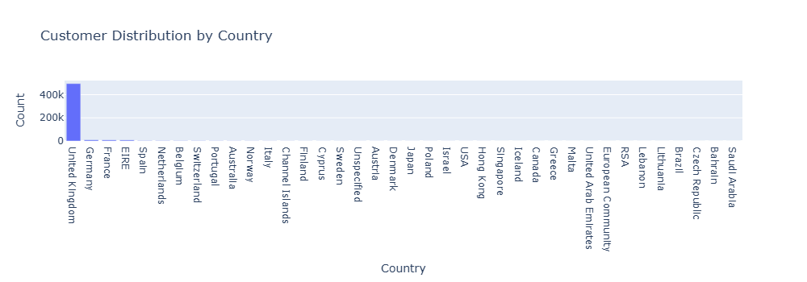

# 🛍️ Customer Behavior Analysis Using Python

Exploratory analysis of customer purchasing behavior using the Online Retail dataset — real transaction data from a UK-based online retail store. The project covers purchasing patterns, customer segmentation by value, country-level trends, a conversion funnel, and churn estimation.

## 📌 Project Overview

The goal is to turn raw transaction records into business-relevant insight: which countries drive the most activity, how customers cluster by lifetime value, and what share of the customer base has likely churned.

## 📊 Dataset

**Online Retail dataset** — UK-based online retailer transactions, Dec 2010–Dec 2011, ~541,909 rows, including `CustomerID`, `Country`, `Description`, `Quantity`, `UnitPrice`, `InvoiceNo`, and `InvoiceDate`.

- Kaggle (CSV, matches this project's column names exactly): [lakshmi25npathi/online-retail-dataset](https://www.kaggle.com/datasets/lakshmi25npathi/online-retail-dataset)
- Canonical source: [UCI Machine Learning Repository — Online Retail](https://archive.ics.uci.edu/dataset/352/online+retail)

**The raw dataset is not committed to this repository** (it's a public dataset, not source code, and too large to version sensibly). To run this project:
1. Download the dataset from the Kaggle link above
2. Save/rename it as `data.csv`
3. Place it in the repository root, alongside `customer_behavior_analysis_using_python.py`

## 🛠️ Technologies Used

- **Python 3**
- **Pandas** — data manipulation and aggregation
- **Plotly Express** — all charts in this project are interactive Plotly visualizations
- **Kaleido** — static PNG export for Plotly figures

## 📈 Workflow

1. Load the dataset
2. Print summary statistics (numeric and categorical columns)
3. Compute `TotalPrice` (Quantity × UnitPrice)
4. Visualize transaction value distribution
5. Visualize customer distribution by country
6. Examine quantity vs. unit price relationship
7. Visualize average quantity purchased by top 10 countries
8. Segment customers by Customer Lifetime Value (CLV)
9. Build and visualize a customer conversion funnel
10. Estimate churn rate based on 6-month inactivity

## 📁 Folder Structure

```
Customer-Behavior-Analysis/
├── images/
│   ├── total_price_distribution.png
│   ├── customer_distribution_by_country.png
│   ├── quantity_vs_unit_price.png
│   ├── avg_quantity_by_country.png
│   ├── clv_segments.png
│   └── conversion_funnel.png
├── customer_behavior_analysis_using_python.py
├── requirements.txt
├── .gitignore
├── LICENSE
└── README.md
```

`data.csv` is intentionally excluded — see Dataset section above.

## 📊 Visualizations

### Transaction Total Price Distribution

*Distribution of transaction values across all orders.*

### Customer Distribution by Country

*Transaction volume by country, highlighting the store's primary markets.*

### Quantity vs. Unit Price

*Relationship between quantity purchased and unit price, with an OLS trendline.*

### Average Quantity by Country (Top 10)

*The 10 countries with the highest average quantity purchased per transaction.*

### Customer Segmentation by CLV

*Customers grouped into Low / Medium / High value segments based on total lifetime spend.*

### Customer Conversion Funnel

*Funnel from unique customers to unique transactions to total quantity purchased.*

> **Status:** these charts are not yet generated in this repo — `images/` is currently empty because `data.csv` hasn't been added yet (see Dataset section). Run the script locally with the real dataset to populate this folder, then commit the PNGs. No placeholder or fabricated images are included here.

## 🚀 How to Run

1. Download the dataset (see Dataset section) and save it as `data.csv` in the repository root
2. Install dependencies and run:

```bash
pip install -r requirements.txt
python customer_behavior_analysis_using_python.py
```

This will print summary statistics and the churn rate to the console, save static PNG versions of every chart to `images/`, and also attempt to open each chart interactively in a browser tab (via `fig.show()`) — if you're running this on a headless server or CI environment with no display, expect that part to be a no-op or to error depending on your setup; the PNG export to `images/` will still work either way.

If `data.csv` is missing, the script raises a clear `FileNotFoundError` pointing back to this section instead of a generic pandas error.

## 🔧 Known Limitations

- **CLV segmentation excludes non-positive values.** The segmentation bins start at 0, so customers with a CLV of zero or below — which happens in this dataset due to returns and cancellations — fall outside all three bins and are silently dropped from the segment counts.
- **Churn rate covers identified customers only.** The churn calculation groups by `CustomerID`, and pandas drops rows with a missing `CustomerID` by default. This dataset contains a meaningful number of anonymous/guest transactions, so the reported churn rate reflects identified customers, not the full transaction volume.
- No explicit data cleaning (duplicate removal, missing-value handling) is currently performed beyond the `TotalPrice` calculation and datetime conversion.

## 🔮 Future Improvements

- Add an explicit data-cleaning step (duplicate removal, missing-value handling) instead of relying on implicit pandas defaults
- Extend CLV segmentation to explicitly handle zero/negative values (e.g. a "Returned / No Value" segment) rather than silently dropping them
- Report the count of anonymous transactions excluded from the churn calculation, or assign them a placeholder ID so they're not silently dropped
- Pin dependency versions in `requirements.txt` for reproducibility
- Add a flag to skip `fig.show()` for headless/CI runs, keeping only the PNG export behavior
- Add basic unit tests for the aggregation logic (`segment_customers_by_clv`, `calculate_churn_rate`, `build_conversion_funnel`)

## 📄 License

This project is licensed under the [MIT License](LICENSE).

## 🧑‍💻 Author

**Chandrakanth Dahima**
Data Analyst | Hyderabad, India
[chandrakanthdahima@gmail.com](mailto:chandrakanthdahima@gmail.com)
